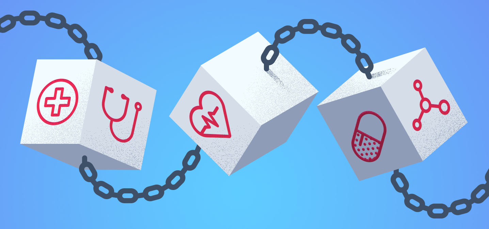
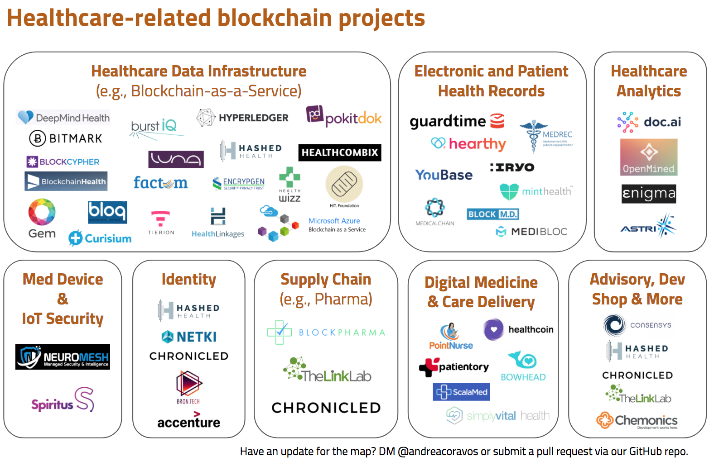

# Where are the healthcare-related blockchains?

We've drafted an open-source landscape map for healthcare-related blockchains. This repository was inspired by conversations with [Paul](https://github.com/pfletcherhill) from [PatientBank](https://www.patientbank.us) and Chris from [Hashed Health](https://hashedhealth.com). We wanted to answer the question: *Who is working on blockchain-related technologies for our industry?*

## Overview & Methodology
There's a lot of opportunity to use blockchain technologies in healthcare -- [and there are a lot of myths, too](https://blog.andreacoravos.com/myth-busting-can-a-blockchain-save-healthcare-d398cdebf0c1).

We put together a first cut of this map and wanted to open it up to the community to share updates. Many of the companies on this list are early stage (e.g., vaporware). Over time, we hope to see more projects in production, but few are ready yet.

Have a better way of organizing the landscape? Did we miss a company? Submit a pull request. You can fork the [landscape map slide (Google Slides)](https://docs.google.com/presentation/d/1yJ9d4w0HpSJ8Wccc3hQQGNmZmqCSwExiFOFWXPVaPvY/edit?usp=sharing). *To add your company to the map, please add your logo to the [Logos folder](https://github.com/acoravos/healthcare-blockchains/tree/master/logos) when making a pull request or else we will be unable to accept your request.*

## Healthcare Projects using Blockchain Technologies
*Projects listed in alphabetical order*

To update this list, submit a pull request.

|  Project  | Background (400 characters or less) | Contact |
|:---|:---|:---|
|[Accenture](https://www.accenture.com/us-en/insight-perspectives-health-healthcare-innovation) | Accenture is a global professional services company that includes strategy, consulting, digital technology and operations services. Accenture partnered with Microsoft and Avanade to develop an identity prototype based on blockchain technology that could provide a digital identity for 1.1 billion people who don't have a formal ID. ||
|[Astri](https://www.astri.org/) | The Chinese government formed Astri, formally known as the Hong Kong Applied Science and Technology Research Institute. Astri developed a health technology platform that aims to drive disruption in the traditional healthcare field with preventative health monitoring, medical computing and diagnostics.|corporate@astri.org|
|[BitMark](https://bitmark.com/) | UC Berkeley and Bitmark partner to bring data donation to public health studies. Bitmark technology allows users to take ownership of their digital lives and help advance the frontiers of public health. Read this [Medium post](https://blog.bitmark.com/uc-berkeley-and-bitmark-partner-to-bring-data-donation-to-public-health-studies-3e9a17891432) on the BitMark UC Berkeley partnership. |support@bitmark.com|
|[BLOCK M.D.](https://www.block-md.com/) | “BLOCK M.D.” is the platform for Health Information Exchange (HIE) and Electronic Health Records (EHR) on enterprise-grade, permissioned-based blockchain technology. This platform enables secure, high-data-integrity interoperability across hospitals, healthtech startups, labs, insurances, regulators and, definitely, patients through well-defined API and data standard. The company is partnering with Thai government for trial in 2018. |hello@smartcontractthailand.com|
|[Blockchain Health](https://blockchainhealth.co/) | Blockchain Health is a software company that provides healthcare organizations with HIPAA-compliant blockchain solutions. Users can share health data with researchers using the integrated platform, which creates a tamperproof chain of information custody.|info@blockchainhealth.co|
|[BlockCypher](https://blockcypher.com)|BlockCypher provides blockchain agnostic web services and infrastructure. Instead of forcing everyone to use one blockchain, BlockCypher enables healthcare organizations and patients to leverage multiple blockchains-- and use the blockchain best suited for a particular use case. For example, BlockCypher enables users to use the Patientory network to manage medical information and pay for services or medication using the Dash network. BlockCypher also provides a proof of patient identity across blockchains, e.g. Ethereum and Dash blockchains.|karen@blockcypher.com|
|[Blockpharma](https://www.blockpharma.com/) | Blockpharma is a French start-up focused on solutions to trace drug sales online. Blockpharma developed an application programming interface that can plug into pharmaceutical companies' information systems, so when the companies release product information and QR codes, the blockchain records subsequent transactions.|contact@blockpharma.com|
|[Bloq](http://bloq.com/) | Bloq produces enterprise grade blockchain technologies to organizations across industries. The company's bloqEnterprise software solution allows users to create, test, update and customize permissioned blockchains; bloqThink provides the strategic architecting, design, development and education for bloqEnterprise; and bloqLabs provides space for blockchain research and testing.|hello@bloq.com|
|[Bowhead Health](https://bowheadhealth.com/) | The Bowhead platform comprises of the Bowhead device which monitors a customer’s biometric data to dispense personalized supplements and medicine. The patent pending “Anonymized Health Token” allows customers and Bowhead token holders to be compensated for the leasing of medical data, and patients have full control of this by means of smart contracts. We believe patient data is some of the most valuable data in the world. The first health survey game is due during the third quarter of 2017 and Bowhead hardware device trial for 200 people due in the second quarter of 2018.||
|[Bron.tech](https://bron.tech/) | Bron.tech uses blockchain powered by Ethereum, a decentralized platform for applications, to create a decentralized infrastructure for data wallets. The company distributes data storage and ensures integrity while also rewarding users with a native digital currency managed on the blockchain. Users contribute data in exchange for the company's digital currency, cash or offers from business partners.|info@bron.tech|
|[burstIQ](http://www.burstiq.com/) | Founded in 2015, burstIQ's platform leverages blockchain and machine intelligence to bring together disparate data sources into a unified, HIPAA-compliant data repository. The platform is fully operational with multiple business customers; in 2016, the platform processed 25 billion data points. BurstIQ's HealthWallet allows users to buy, sell, donate, license or loan data; the LifeGraph platform brings together an individual's health data in one place and allows users to manage data through smart contracts. BurstChain is the company's big data blockchain platform for securely managing large, complex health data sets.||
|[Chemonics](http://www.chemonics.com/Pages/Home.aspx) | Chemonics is an international development consulting firm spanning 70 countries and industries. In October 2016, Chemonics and BanQu partnered to establish the Blockchain for Development Solutions Lab to build, test and scale blockchain solutions that aim to reduce poverty and increase the effectiveness of social programs.||
|[Chronicled](https://www.chronicled.com/) | Chronicled launches pharma initiative.  Blockchain startup Chronicled and LinkLab have launched The MediLedger Project, a joint venture aimed at exploring blockchain solutions for the pharma industry. Genentech, a member of the Roche group, Pfizer, AmerisourceBergen, and McKesson have already signed on.|support@chronicled.com|
|[Curisium](https://www.curisium.com/)|The Curisium platform deploys blockchain and secure computation technologies to allow payers, providers and life science companies to engage in patient-centric value-based contracts.|info@curisium.com|
|[DeepMind Health](https://deepmind.com/blog/trust-confidence-verifiable-data-audit/)| Google's DeepMind Health is working on a blockchain-like ["Verifiable Data Audit"](https://deepmind.com/blog/trust-confidence-verifiable-data-audit/) to ensure auditability, the ability to show and justify if logs are challenged. DeepMind sees Verifiable Data Audit as a powerful complement to this scrutiny, giving partner hospitals an additional real-time and fully proven mechanism to check how DeepMind is processing data.||
|[Doc.AI](https://doc.ai/) | Doc.AI's Robo-Genomics platform is a deep conversational agent designed to improve genetic data comprehension and provide decision support. The agent can converse on disease, traits, pharmacogenomics and family planning. Doc.Ai's founder Walter De Brouwer was one of three parties that executed the first life insurance contract on the public blockchain with bitcoin in January 2017.|info@doc.ai|
|[EncrypGen](https://www.encrypgen.com/)|Encrypgen provides next generation software for genomic data empowering patients and donors, facilitating health, business, and science in a safe environment.|drkoepsell@encrypgen.com|
|[Factom](https://www.factom.com/) | Factom is a blockchain-as-a-service technology company that received $8 million in Series A funding in April 2017. In November 2016, the Bill and Melinda Gates Foundation awarded Factom a grant to develop an infrastructure for medical records on the company's blockchain.||
|[Gem](https://gem.co/health/) | Gem is an enterprise blockchain company. The GemOS enterprise platform for healthcare allows all stakeholders secure access to shareable data with the right permissions. The platform is in compliance with HIPAA, streamlining communication along the continuum of care. Gem entered into a partnership with Philips in 2016 to explore how blockchain can support the patient-centered approach to care. At Gem, we're building towards a blockchain network for the global community of companies that take part in the continuum of healthcare. Blockchain technology addresses the trade-off between personalized care and operational costs by connecting the ecosystem to universal infrastructure. Shared infrastructure allows us to create global standards without compromising privacy and security.|hello@gem.co|
|[Guardtime](https://guardtime.com/) | Guardtime's platform is designed for data and systems security at the industrial level. The company partnered with the Estonian eHealth Foundation in February 2016 to accelerate the adoption of blockchain-based transparency and auditable lifecycle management for patient records. The partnership integrated KSI blockchain with existing Oracle databases for increased security, transparency, auditability and governance for electronic systems and patient records.||
|[Hashed Health](https://hashedhealth.com/) | Hashed Health is a blockchain development studio focused on building healthcare applications within a product-focused collaborative ecosystem. To empower its enterprise partners, Hashed Health provides value-added services such as product management, product development, business advisory, education, and technology support services for blockchain solutions and distributed networks.Based in Nashville, Tennessee, Hashed Health’s healthcare experts focus on ensuring that business problems drive the appropriate technical solutions. By convening existing networks with engaged developer communities actively exploring, piloting, and developing applications, we are able to launch new more effective and novel solutions.|info@hashedhealth.com|
|[Health Wizz](https://www.healthwizz.net/) | Health Wizz is a wellness application platform that acquired healthcare blockchain company kreateloT in January 2017. The combined company is working on Mercatus, a platform allowing individuals to build their own digital health portfolio and grant access to medical researchers, health data scientists, pharmaceutical companies and others in one marketplace to advance precision medicine. Mercatus would allow users to write smart contracts on Ethereum blockchain to trade health data for crypto-currency.||
|[Healthcoin](https://www.healthcoin.com/) (A ConsenSys Project) | Healthcoin is the world's first blockchain-enabled platform for diabetes prevention. Our mission is to allow employers, insurers and governments across the globe to incentivize and manage their population's lifestyle change. Unlike the vast majority of rewards programs, Healthcoin is biomarker-based. We measure the actual blood lab indicators of disease, rather than just correlates like steps or stress. Our blockchain uses these biomarkers to generate tokenized "prevention certificates" that any (permissioned) stakeholder can verify and reward. By accumulating biomarkers on the blockchain, we also create innovative data analytics: patient-owned health records with data viz, population health management tools, and a potentially vast longitudinal research trial.|info@healthcoin.com|
|[HealthCombix](http://www.healthcombix.com/) | HealthCombix's platform is a token-based healthcare payment and risk management network enabling payments, data asset monetization and risk adjustment. The platform preserves digital privacy while allowing for interoperable data exchange, giving patients and providers control over the data. The company believes blockchain technology will allow consumers to control the brokerage of their data for research, precision health, clinical trials, payment and disease intervention.|disrupt@healthcombix.com|
|[Health Linkages](http://healthlinkages.com/)|Health Linkages is the Data Provenance Company. We use blockchain-inspired technology to enable healthcare institutions to trust, protect and comfortably share their data.|info@HealthLinkages.com|
|[Hearthy](https://hearthy.co/) | Hearthy wants to create a decentralized, open and sustainable ecosystem to improve health care access to everyone, regardless of income. Hearthy’s ecosystem will make healthcare more efficient, agnostic to jurisdiction and patient-centered.|
|[HIE of One](https://http://hieofone.org/)|HIE of One is a free software project developing tools for patients to manage their own health records.[1] HIE stands for Health Information Exchange, an electronic network for sharing health information across different organizations, hospitals, providers, and patients. This is one of a growing number of tools for encrypted data exchange within the health care sphere. A proposal  for using HIE of One in conjunction with blockchain technology was reviewed by the US Office of the National Coordinator (ONC), winning an award from the ONC.||
|[HIT Foundation](https://hit.foundation/) | HIT Foundation offers an online marketplace for personal health data that allows users and patients to trace data usage and participate in its monetization. It is the first ecosystem that allows everybody to get paid for health information instead of paying others to process or store it. The distributed system supports the global execution of new or existing business cases for information seekers on top of the HIT platform without the need for intermediaries. |info@hit.foundation|
|[Hyperledger](https://www.hyperledger.org/) | The Hyperledger Healthcare Work Group identifies opportunities for open source software development projects to host on Hyperledger, an operating system for marketplaces, data sharing networks, micro-currencies and decentralized digital communities. In May 2017, Hyperledger hosted a Hyderabad Meetup to discuss the most beneficial blockchain applications in healthcare.||
|[IBM Blockchain](https://www.ibm.com/blockchain/) | IBM Blockchain is the first managed service for Hyperledger Fabric, enabling the creation of blockchain business networks that owners can control and distribute across different organizations. In August 2016, IBM won the HHS Office of the National Coordinator of Health Information Technology's blockchain health IT ideation challenge with a paper describing the potential impact blockchain could have on resolving interoperability, scalability and privacy challenges in healthcare.||
|[Iryo](https://iryo.io/)|Iryo network is the world's first participatory healthcare ecosystem build on standardised zero-knowledge electronic health record storage. Disrupting the landscape of traditional health IT by promoting standardised health-data archetypes, redefining medical data ownership and securing from unauthorised access.|info@iryo.io|
|[Luna](https://www.lunadna.com/)|A genomic and medical research database powered by the blockchain. Luna is a community owned database that rewards individuals Luna Coins for contributing their DNA and other medical information.|info@lunaDNA.com|
|[Lympo](https://lympo.io/)|Lympo.io is a fitness wallet that will utilise the data users track on their smartphones and wearables to reward LYM tokens for achieved fitness and mindfulness goals and build a healthy lifestyle ecosystem based on user-controlled fitness data. Its players will range from health insurances and employers incentivizing healthy lifestyle to developers submitting new data applications.|ada@lympo.io|
|[MediBloc](https://medibloc.org/) | MediBloc is creating a decentralized healthcare information ecosystem on blockchain where medical records can be kept safely and securely transferred by their rightful owners, the patients and not the hospitals.  MediBloc is the first healthcare blockchain company that targets Asia where PHR disruption makes much more sense than the US or European PHR market.||
|[Medicalchain](https://medicalchain.com/en/) | Medicalchain uses blockchain technology to store health records securely so physicians, hospitals, laboratories, pharmacists and health insurers can request a patient's permission to access the record as well as record transactions on the distributed ledger. Medicalchain is set to launch in September 2017.| contact@medicalchain.com |
|[MedRec](https://www.media.mit.edu/research/groups/1454/medrec) | Graduate student researchers at Massachusetts Institute of Technology in Boston developed MedRec, a system for managing medical records using the Ethereum, a decentralized platform for applications. MedRec is designed for patients to control their medical data, including clinical EHR records and data from personal health wearables like Fitbit. Patients can securely allow healthcare providers, researchers and family members to access their data. Medical researchers can also mine the data to sustain the blockchain authentication log and receive anonymous medical metadata in return.||
|[Microsoft](https://azure.microsoft.com/en-us/solutions/blockchain/) | In June, Microsoft partnered with Accenture to build a blockchain prototype for healthcare as well as other industries. The blockchain will create a digital identity for 1.1 billion people around the world who don't have a formal identity, including refugees. The current model builds on Accenture's blockchain and operates on Microsoft Azure's cloud platform.||
|[MintHealth](https://www.minthealth.io/) | MintHealth announced the launch of its self-sovereign health record platform at the Connected Health Conference in Boston in October 2017. Powered by blockchain technology, the service allows patients to access their health records in real-time through a mobile or web app, and features a specialized digital currency as an incentive for preferred patient behaviors.|info@minthealth.io|
|[Netki](https://netki.com/) | Netki aims to support blockchain use with the Open Source, Open Standards tools for digital identity. The company removes risk and compliance barriers to blockchain projects. In May 2017, Netki launched a digital identity service to make blockchain safe for business, finance and healthcare applications. The Digital ID works across public and private blockchains to reduce risk associated with blockchain transactions.||
|[NeuroMesh](http://www.neuromesh.co/) | A vaccine for your IoT. Neuromesh uses the Bitcoin blockchain to protect expensive equipment like X-Rays and MRI machines from attacks.||
|[OPAL/Enigma](https://www.trust.mit.edu/projects) | Published a paper on Blockchain and Health IT: Algorithms, Privacy and Data. Check out [the whitepaper](https://www.healthit.gov/sites/default/files/1-78-blockchainandhealthitalgorithmsprivacydata_whitepaper.pdf). | |
| [OpenMined](https://openmined.org/) | The OpenMined project is volunteer-only, open-source project aiming to create the world’s largest decentralized network of encrypted personal information. In this world, the user gets to own their information and store it themselves, while data scientists and developers pay for anonymized access to this information. The community has started to explore healthcare applications. Join the [Slack](https://openmined.slack.com/) for more details. | |
|[Patientory](https://patientory.com/) | Patientory was founded in 2016 through the Boomtown Health-Tech Accelerator in Boulder, Colo. Patientory collaborates with Denver-based Colorado Permanente Medical Group, a member of Oakland, Calif.-based Kaiser Permanente. Patientory allows users to create profiles on a mobile app to securely store, manage and share medical information. The solution is compatible with Epic, Cerner, Allscripts and Meditech, among other EHR systems.|info@patientory.com|
|[PointNurse](https://www.pointnurse.com/) | Founded in 2014, PointNurse is a virtual and on-demand care platform that allows nurses to lead consumer-focused care outside of the hospital and clinic setting. The platform is a blockchain-based digital community enabling licensed professionals to engage in secure and private conversations with patients in remote locations.|team@pointnurse.com|
|[PokitDok](https://pokitdok.com/) | PokitDok provides a free, secure software development platform for healthcare businesses. The company powers DokChain, a distributed network of transaction processors operating on financial and clinical data across the healthcare industry. As of March 2017, the company had raised $48 million to develop DokChain.||
|[ScalaMed](http://www.scalamed.com/) | ScalaMed believes in centering and empowering the consumer on their healthcare journey. ScalaMed is building a scalable, integrated and secure platform for managing healthcare transactions and data. ScalaMed is beginning its healthcare revolution through providing a decentralized application for patients, doctors and pharmacists to manage, prescribe and dispense prescription medicines.||
|[Spiritus](http://www.spirituspartners.com/)|Spiritus offers cloud-based assurance software for safe, secure and compliant use of critical assets at the point of use and accountability. Overcome costly, inefficient siloes and gain necessary transparency, verifiability and auditability across an asset's service life through a blockchain-enabled, permissioned network. Rely on Spiritus to be sure an asset's in good order - from service providers and operators, upstream to manufacturers and distributors, and downstream to field service engineers, MROs and specialists in testing, inspection, certification and audit.  With support from the Scottish government, the company has undertaken a pilot with NHS Scotland and a leading cybersecurity researcher at Edinburgh Napier University.|sramonat@spirituspartners.com|
|[SimplyVital Health](https://www.simplyvitalhealth.com/) |Intentionally simple care coordination platform backed by Blockchain technology to create a tamper-proof audit trail. Providers use our tool to support care coordination in Bundle payments and to attain MACRA requirements.| LetsDoThis@simplyvitalhealth.com |
|[Tierion](https://tierion.com/) | Tierion's HashAPI allows developers to anchor up to 100 records per second on the blockchain for free, with time stamping and data security. Tierion was the first company to join Philips' Blockchain Lab to explore using blockchain in healthcare. The company has also partnered with Microsoft to build a service linking data to blockchain to prove the data's integrity and existence.||
|[YouBase](https://www.youbase.io/) | YouBase combines blockchain compatible technologies to deliver a secure and flexible container for independent data. The company's solution allows individuals to maintain their data and identity across networks and share data as they chose. Youbase.io is designed to decentralize sensitive consumer and personal information while compiling a single source of anonymous data.|info@youbase.io|

## Where are the Healthcare ICOs?
Thankfully [vincek39](https://github.com/vincek39) has come to our rescue and he's created a [Google Doc](https://docs.google.com/spreadsheets/d/1TANOZmuYtVhyn1C9PV6YLsOBlQNOEOBExB7u2_Kkork/edit#gid=0) of the ICOs and token sales in the healthcare industry, all 38 of them (as of 12/1/18). 

## Request for moderators
Want to help support this repo and manage pull requests? We're looking for people who can lead the charge to maintain this repo. DM me at [@andreacoravos](https://www.twitter.com/andreacoravos) to become one of our moderators.
